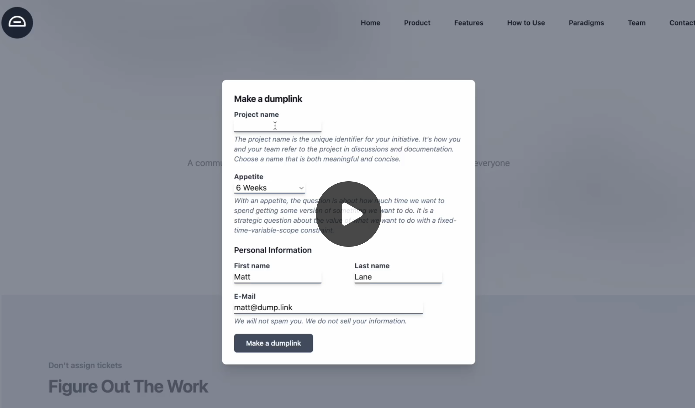

# Dumplink

[Dumplink](https://dump.link) is inspired by the Shape Up methodology from [37signals](https://37signals.com).

In short, Dumplink helps creative problem-solving teams avoid delays and rework. Dumplink helps teams decompose a discrete concept that has been shaped and bet on, finish some version of it, and ship within a fixed time budget.

Dumplink is not about reactive (ticket) work. Ticketing systems are for reactive work and are well suited for Kanban management, i.e., processing bugs, issues, and urgent requests that cause a team to be dependent on others’ schedules. This is a very different type of work than strategically planned work that goes through framing and shaping. That said, we do need both systems—unplanned and planned workstreams.

Dumplink helps teams that are concerned with deliberate work that is meaningful to the business while meeting the needs of customers and moving the product forward in the direction the organization wants to go.

To do that, we want the project to stay "whole" through the entire process so we never lose sight of the bigger picture. With well-shaped, de-risked projects, teams have the latitude to adjust the scope to "some version" of the initial solution outline. Nobody plays the role of the "taskmaster" or the "architect" who splits the project up into pieces for other people to execute. Splitting the project into tasks up front is like putting the shaped work through a paper shredder. Everybody just gets disconnected pieces.

Dumplink is a systems thinking work editor tool that acts as a communication bridge between business and technical teams to keep everyone focused on the real work. Think of Dumplink as an alternative to a Kanban board. Those are well-suited for pulling in reactive unit work items that take less than a week to clear. Dumplink’s design is intended for Small Launch Teams to work scope-by-scope (task groups), one vertical slice of shippable work at a time, i.e., functions and then finishings, to address a singular fitness function.

## Demo Video

## Components

The pieces that make up this tool are:

- **DUMP**: Break down the shaped project into an unstructured list of tasks.
- **CLUSTER**: Cluster that list of tasks into shippable vertical slices of work we call task groups.
- **SEQUENCE**: Sequence and arrange the task groups.

The programmer(s) and designer (“Small Launch Team”) kick off the project cycle, read the shaped project outline document together, and chat with the shaper(s) who packaged the work to be developed.

The Small Launch Team dumps everything they think they will have to do into the dump. This helps the team consider the package of shaped work as a whole by turning the whole thing into rough implementation tasks without concerning themselves with structure and order before starting on any one area.

The Small Launch Team drags these initial tasks into unnamed groups by asking themselves: "What can be completed together and in isolation from the rest?". Task group boxes are named after the Small Launch Team clusters the tasks and looks at the actual work to ensure the task groups show real relationships in the work and not arbitrary categories. The Small Launch Team considers which task groups have risky unknowns and flags them. Seeing all the groups together helps to do this because the question of "what is unknown" is relative.

A Small Launch Team draws an arrow from one task group to another illustrating the causal structure of how things are connected. This lets teams know when they have the required inputs completed that the next task group needs—to work on task groups with more outgoing than incoming connections so teams know where to start building. This lets everyone understand what "completed" means in a path-dependent chain of unknowns and dependencies to ensure we do not hit a problem too late or in the wrong order and expand the scope unnecessarily.

Tracking what is unknown and what is known is more important than tracking what is not done and what is done when you are looking to see the status of a project. This can be done without counting tasks and without numerical estimates by shifting the focus from what's done or not done to what's being figured out and what is figured out.

It's more satisfying to have the conversation at the level of task groups and point to vertically finished pieces of software we can feel and click around in instead of going down into the weeds and defending the purposes and status of individual outstanding implementation details (tasks).

This is all about trying to communicate risk, i.e., task groups depend on every task being completed for the vertical slice to function. If any task is unknown, the task group is at risk. The state of a task group may simply be the state of the most risky task within it.

## With Dumplink, teams can:

- See exactly what is moving, what isn’t, and what is at risk.
- See what’s unsolved, solved, and done.
- Avoid rework and delays.

Because it helps teams:

- Know which things need to be solved now and what can be sequenced later.
- Make progress on the right tasks first.
- Know if a variable scope project is going to be finished on time; and, if the time budget is all used up, and the project is not finished (in post-launch), how many unknowns and/or knowns convert into overrun items, which informs teams if they should extend the project or move on to other options.

## Feature suggestions to spark inspiration for future contributions, circa 2024-05

1. Task groups have a “Not started” default phase.
2. Remove the counter on task groups showing how many tasks are unknown and how many are known and simply add a slider as seen in the image below.  More human this way. Use gray for “Not started”. Orange for “Figuring it out” (unsolved WIP, i.e., unknowns). Yellow for “Executing down” (solved WIP, i.e., no unknowns). And green for “Done”. [See this scribble.](readme_scribble.png)
3. Add a cut task group (cut scope) affordance as seen in the above image represented as a scissor signifier. Normalizing variable scope with a button at the task group level is in line with the philosophy.
4. Add a dedicated projects list view like the [Lineup](https://3.basecamp-help.com/article/668-lineup) screen as seen in Basecamp to represent in-flight projects and their time budgets. This is where teams can find and create new Dumplink projects.
5. Allow teams to create reactive boards or a project scheduler like Kanban (so, not a Dumplink build project). Some work is reactive, and keeping that pipeline of work in the same tool makes it more useful. Also, a column system can be used to create a feeder into Dumplink projects, e.g., the columns could be: Raw ideas (ideas or questions we might frame)→Framing (raw ideas we are getting into a tighter problem definition from the context and desired outcome)→Shaping table (framed opportunities to potentially bet on shaping)→Shaping in progress (getting to fewer unknowns and paths around how an approach could work)→Development table (a de-risked path to potentially bet on building out)→Dispatch build cycle (selected packages of shaped paths that are to be dispatched and kicked off next build cycle [these cards automatically turn into Dumplink projects (viewed in the Lineup-like tool) and archive the decision point in the Scheduler after x days]).
6. Combine task group progress statuses (aggregation of all task group sliders) into one macro slider at the top of the pages near the appetite time box to get a snapshot of progress across the whole project.
7. Add a post-launch section to make additional decisions, e.g., marketing materials, state outcomes, handling known items that overran the time budget, etc.
8. Link section in setting to the top-level project story (package of shaped work doc), project repo, online whiteboard where shaping work happened, customer discovery artifacts, etc.
9. Cancel the project affordance with reasons.
10. Visual design: More padding, less borders.

## Attribution

We ask that if you use this software for anything you please attribute it to authors Klaus Breyer ([@klausbreyer](https://github.com/klausbreyer)) and Matthew Lane ([@mattlane66](https://github.com/mattlane66)) at [https://dump.link](https://dump.link/)

## Acknowledgements

- Code developed by Klaus Breyer ([@klausbreyer](https://github.com/klausbreyer))
- Conceptual contributions by Matthew Lane ([@mattlane66](https://github.com/mattlane66))
